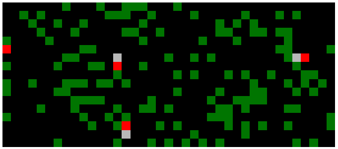
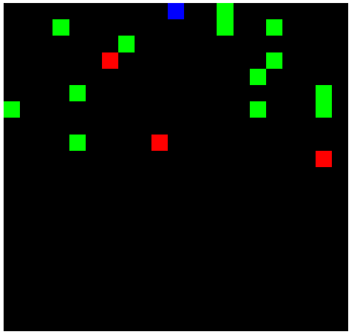

# CPR appropriation

<p align="center">
	
</p>

This repository contains different implementations of policy gradient RL techniques, that have been applied to the Harvest (or Gathering) multi-agent environment, introduced in [[1]](#1). The environment is implemented from scratch to be compatible with [OpenAI Gym](https://gym.openai.com/). Policy gradient algorithms (i.e. REINFORCE, VPG, TRPO and PPO) rely on custom implementations (see the [policies.py](policies.py) module), while value-based methods (i.e. the DQN baseline) rely on [RLlib](https://docs.ray.io/en/latest/rllib.html) (see the [rllib.py](rllib.py) module). Take a look at the full [report](report/report.pdf) for a detailed explanation of the work done.

## Environment

### Parameters
The environment can be customized with the following parameters, to be given as attributes at construction time (i.e. when calling `gym.make`):
- `n_agents`: number of agents in the environment
- `grid_width`: width of the environment's grid (x-axis)
- `grid_height`: height of the environment's grid (y-axis)
- `fov_squares_front`: how many grid squares in front of the agent to consider for local observation extraction (defaults to 20)
- `fov_squares_side`: how many grid squares on each side of the agent to consider for local observation extraction (defaults to 10)
- `tagging_ability`: enable or disable the tagging action (defaults to enabled)
- `tagging_steps`: how many time-out steps for agents tagged by the laser beam (defaults to 25)
- `beam_squares_front`: range of the laser beam on the y-axis (defaults to 10)
- `beam_squares_width`: range of the laser beam on the x-axis (defaults to 5)
- `ball_radius`: radius of the ball around each empty position to be used for resource re-spawn (defaults to 2)
- `max_steps`: maximum number of steps for an episode (defaults to 1000)
- `initial_resource_probability`: probability of resource spawn at the very beginning of the episode (defaults to 0.05)
- `gifting_mechanism`: which kind of gifting strategy to use (defaults to none)
  - 0 represents the zero-sum method
  - 1 represents the fixed budget method
  - 2 represents the replenishable budget method
- `gifting_fixed_budget_size`: size of the budget in case the gifting mechanism is "fixed budget" (defaults to 40)

### Social outcome metrics
The environment exposes the `get_social_outcome_metrics` function, that returns a dictionary filled with Efficiency (U), Equality (E), Sustainability (S) and Peace (P) metrics for the current episode, as described in the original paper.

### Observations
Observations are always computed as an RGB image in which the current agent is colored in blue, opponents are colored in red, resources in green and empty cells in black. In case you want to have a look at agents' observations, you can plot them using the following logic:
```python
observations = env.reset()
for agent_handle in env.n_agents:
	env.plot_observation(observations[agent_handle])
```

<p align="center">
	
</p>

## Installation
In order to install all the dependecies required by the project, you have to `cd` to the root folder of the project and run the following commands:

```bash
python3 -m venv venv
source venv/bin/activate
pip install src/gym_cpr_grid
pip install -r requirements.txt
```

## Execution
The CPR appropriation environment can be used from another project, as it is a standalone pip package. In order to use it, simply run the following:
```python
import gym

env = gym.make(
    'gym_cpr_grid:CPRGridEnv-v0', 
    n_agents=n_agents, 
    grid_width=grid_width, 
    grid_height=grid_height,
)
```

If you want to see a working example, please check out the [cpr.ipynb](cpr.ipynb) Jupyter notebook, that contains an explanation of the methods in use, along with a comparison of all the implemented solutions. You can also head over to the public [W&B project](https://wandb.ai/wadaboa/cpr-appropriation) containing plots for performed experiments.

If you want to use the CPR environment with RLlib, have a look at the [rllib.py](rllib.py) Python module, which contains a FC network compatible with RLlib's API, a class with callbacks for social outcome metrics and the DQN baseline described in the original paper.

## References
- <a id="1">[1]</a>
  _Julien Perolat, Joel Z. Leibo, Vinicius Zambaldi, Charles Beattie, Karl Tuyls, Thore Graepel (2017)_,\
  **A multi-agent reinforcement learning model of common-pool resource appropriation**,\
  CoRR.
